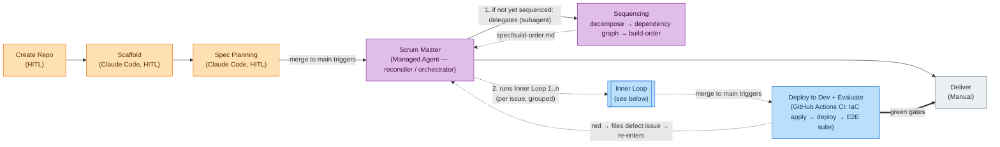
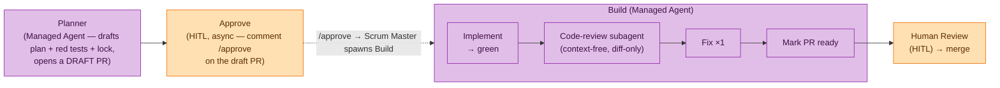

# Agent-Based Coding Workflow

## Principles

- **Determinism first.** Every step has a defined input, process, and exit condition. Agents operate within guardrails, not open loops.
- **Deterministic pipelines over agentic stages.** Where a step's work is deterministic — apply IaC, deploy, run a committed test suite — it runs as plain CI (a GitHub Actions job), not an agent. LLM test-*generation* stays off the critical path: E2E scripts are authored ahead of time (from the spec, or via a human-invoked `/generate-e2e-tests` skill) and committed; the pipeline only ever *runs* what is already committed. Generate up front; the committed artifact is what executes.
- **Minimize HITL.** Human-in-the-loop is the most expensive step. Only require it where human judgment is irreplaceable — Spec Planning, inner Plan **approval**, and inner Review. Planning is *drafted by an agent* off the critical path; the human only reviews and approves it (async), never waits for it to be produced.
- **AI fixes its own mess.** Pre-commit hooks (lint/format/typecheck, fast, every commit) and the pre-push hook (full test suite — see [Hook strategy](#hook-strategy) below) must pass before a human ever sees the work — up to 3 push-retry attempts, then escalate. A context-free code-review **subagent** also runs, exactly once, before the PR is marked ready — a pre-filter, not a substitute for human review.
- **Context-free code review.** Build spawns a **fresh subagent whose only input is the diff** — no access to Build's own conversation, so it reviews as a fresh reviewer would, not as the author grading its own work. Its single fix-round catches what's obvious from the diff alone; it does not replace the human review that follows.
- **Gradual tool trust.** Tools start locked. A tool whitelist is expanded over time as confidence is established. Agents cannot use tools outside the whitelist without explicit approval.
- **Right model for the task.** Model selection is explicit per step to avoid overspending on cheap tasks and underspending on critical ones.
- **Two execution surfaces, matched to whether a human is in the loop.** Interactive HITL stages (Scaffold, Spec Planning, Inner Review) run as **Claude Code sessions** — reachable from any device including phone, using account-level skills. Automated stages with no human present (Scrum Master, Sequencing, Planner, Inner Build) run as **Claude Managed Agents**. Inner Plan straddles the two: an agent (the Planner) drafts off the critical path, and the human's part is a lightweight **async approval** (`/approve` on the draft PR) — no live session. No infrastructure of my own is provisioned or operated to run any of them.
- **Plan and Build are separate execution surfaces with no shared memory — the plan must be a persisted artifact, not a conversation.** The Planner and Inner Build are different Managed Agent sessions; Build cannot see how the plan was produced. The plan, tests, and lock are committed to the issue's branch specifically so Build has something authoritative to read off the checkout it mounts.
- **Async by default; a resumable orchestrator, never a long-running one.** For automated stages the human is notified only at a HITL gate (a plan to approve, a PR to review) or a structured-error halt. The build phase is driven by the **Scrum Master**, an *orchestrator* Managed Agent that judges the next move and delegates to subagents — but it is **re-invoked per event, not kept alive**: it must never sit in a live session waiting for a human to approve a plan. Two thin GitHub Actions both **launch the Scrum Master** and then exit — a merge to `main`, and a `/approve` comment on a plan's draft PR — so across every async gate the orchestrator wakes, reconstructs its state, acts, and exits. On merge it acts only when something changed that it owns: the approved `spec.md` (→ sequence) or the last issue of a group (→ advance); every other merge is a no-op. Control flow lives in **files and subagents' structured results**, never labels: `spec.md`'s `Status`, the existence of `build-order.md`, each plan's `Status`, and the JSON each subagent returns. No orchestrator infrastructure of my own is hosted; Anthropic runs the agents. Introducing a general orchestrator is a deliberate reversal of the earlier "narrow triggers, no orchestrator" stance — taken because the Scrum Master must be able to *judge* a subagent's outcome (proceed, escalate, re-plan), which a mechanical trigger cannot.

---

## The Workflow

The process is two nested loops. The **outer loop** operates at the project/feature level — it creates and protects the repository, scaffolds it into that repo, and plans the spec, after which the **Scrum Master** — an orchestrator that reconciles on every merge to `main` — sequences the work and drives the build to Deliver. The **inner loop** operates per planned issue — it runs once for every unit of work Sequencing identified, repeating until all planned issues are delivered. Between them, an automated **integration gate** (Deploy to Dev + Evaluate) fires on every merge to `main` — a deterministic CI pipeline, not an agent — validating integrated `main` and gating Deliver.

The outer diagram below refers to the inner loop as a single "1..n" black box; the inner loop is drawn separately beneath it.

**Outer loop — project / feature level.** After Spec Planning, the Scrum Master is the single orchestrator of the build phase: triggered on every merge to `main`, it reconciles from durable state — if the approved spec has not been sequenced yet it delegates to Sequencing; once `spec/build-order.md` exists it advances the groups.



**Inner loop — per issue.** Runs once per issue; issues the SM makes ready in the same parallel group run it concurrently. Plans are **per issue** — the group is only the parallelism unit, not a plan-batching unit. A Planner agent drafts the plan + red tests + lock on the issue branch and opens a **draft PR**; you approve asynchronously by commenting `/approve` on the draft PR, which launches the Scrum Master to spawn Build. Build spawns its own context-free code-review subagent, then marks the same PR ready; Human Review merges. No red tests ever reach `main` — plan, tests, and lock live on the issue branch throughout.



_Legend — 🟪 Managed Agent · 🟧 Claude Code (HITL) · 🟦 Automated · ⬜ Manual._

### Outer Loop — project / feature level

#### Outer · Create Repo `[HITL]`

**Goal:** Stand up an empty GitHub repository that every later stage can rely
on — created, with `main` protected, and the workflow's labels seeded — before
any Claude Code session touches it.

**Why this is its own phase, and first.** The Scaffold session runs in Claude
Code on the Web, which operates *inside* a connected repository but has no
credentials to create one, protect a branch, or manage labels. Those are
GitHub-admin operations, so they must happen where admin credentials exist —
the human, via the GitHub UI or a local `gh`/Claude Code session — before the
Web-based Scaffold session begins. (This reverses the earlier design that
folded repo creation and protection into Scaffold; the end-to-end run showed
Scaffold's surface can't perform them.)

This phase guarantees three things:

1. **Repository creation.** Create an empty private repo whose name **is** the
   project's `project_slug`. This repo name is the source of truth for the slug
   — Scaffold reads it rather than asking for a project name. Initialize the
   repo with a placeholder commit (e.g. a README) so `main` exists and can be
   protected.
2. **Branch protection on `main`.** Protect `main` up front (a ruleset can
   target `main` by name), requiring a PR before merge. From here on *every*
   change to `main`, the scaffold included, goes through a PR. If the
   account/plan can't protect a private repo's `main`, resolve it here — upgrade
   the plan, make the repo public, or use the rulesets API — rather than
   proceeding with an unprotected `main`.
3. **Human-facing labels only (optional).** Control flow uses in-repo file
   state, never labels (see the async/orchestrator principle above), so **no
   `spec:*` control labels are needed** — the old `spec:authored`/`approved`/
   `sequenced` triggers are gone. Seed only labels used as **human-facing
   markers**, e.g. `build:escalated` for assignment/mention when a Build stalls.
   If you seed none, the escalation path can create `build:escalated` on demand.

**Exit condition:** Empty repo exists, named for the project's `project_slug`;
`main` protected (PR required). Any human-facing marker labels (e.g.
`build:escalated`) optionally seeded. No project structure yet — that is
Scaffold's job.

---


#### Outer · Scaffold `[Claude Code, HITL]`

**Goal:** Render a project from a Cookiecutter template into the repo Create
Repo already stood up, and land it on the protected `main` through a PR.
Scaffold does **not** create the repository, protect `main`, or manage labels —
those are Create Repo's (see above), because Scaffold runs in Claude Code on the
Web, which has no credentials for them. **HITL for its inputs, deterministic for
its execution:** the only human-in-the-loop surface is template choice and the
question batch (steps 1–2); everything after — render, branch, commit, push,
open PR — is a fixed, decision-free sequence run by `skills/scaffold/scaffold.sh`.

1. Open a Claude Code session (session #1) **against the repo Create Repo made**
   — it is the connected working checkout. It also needs access to the
   `project-templates` repository — mounted alongside (e.g. `--add-dir`) or a
   throwaway in-session clone — since the template list is read live rather than
   from a maintained reference file.
2. Guided by the `scaffold` skill: read `project-templates` to find and pick a
   template, then read that template's actual `cookiecutter.json` before asking
   anything — the question set is derived from what the template defines, not a
   fixed generic list. Advanced feature toggles (structured logging, security
   scaffolding, etc.) default to off unless there's a reason to enable one. The
   **project name is not asked** — `project_slug` is taken from the repo Create
   Repo already made. Writing `cookiecutter-context.json` with the template's
   exact field names is the **only** judgment work in the step; it's the one
   thing the script can't do.
3. Claude Code invokes `scaffold.sh` with the template directory and the context
   file it just wrote. The script runs the deterministic tail as one sequence:
   - **Renders** the template with Cookiecutter (variables substituted directly,
     not left as placeholders) and lays the generated project into the repo,
     **stopping on a `project_slug` mismatch** with the repo it is in.
   - **Verifies** the tree, running `pre-commit install` when the template
     shipped a `.pre-commit-config.yaml`, and warning if pre-commit config or a
     CI workflow is missing from the render.
   - **Creates a branch** (e.g. `scaffold`) — `main` is protected, so the
     scaffold cannot land directly — then commits the rendered tree to it and
     pushes.
   - **Opens a PR** into `main`. This single PR is the scaffold's path onto the
     protected `main`.
4. If the script exits non-zero, Claude relays its message and stops — it does
   not finish the sequence by hand. The human reviews and merges the scaffold PR
   to complete the phase.

**Exit condition:** Template rendered onto a `scaffold` branch, pushed, with a PR
opened into the protected `main`; on merge, `main` holds the full project
structure with pre-commit and CI config in place. No repo creation, protection,
or label management happens here — those were Create Repo's.

---

#### Outer · Spec Planning `[Claude Code, HITL]`

**Goal:** Agree on what is being built, against the now-scaffolded repository. Decomposition into issues is Sequencing's job, not this stage's — see Outer · Sequencing.

**Why a separate session from Scaffold, not merged.** Scaffold and Spec Planning are both Claude Code HITL sessions, so folding them together looks tempting — Scaffold's footprint is negligible. But `CLAUDE.md`, `.claude/` settings, and project skills/directives load only at **session start**, not when files appear mid-session. A single session begun *before* Scaffold would never pick up the directives the template just installed, and Spec Planning would author blind to the project's own conventions. Starting Spec Planning as a **fresh session after the scaffold PR merges** is precisely what forces those scaffolded directives to load — for the stage that most needs them. The split is the mechanism, not ceremony (see [ADR-0006](adr/0006-scaffold-and-spec-planning-separate-sessions.md)).

1. Open a new Claude Code session (session #2) against the repo, and create a new branch — nothing in this step touches `main` directly, since it's now protected.
2. Guided by account-level skills (`spec-authoring`, `adr-authoring`), Claude Code:
   - Produces `spec/spec.md` — Status, Purpose, Inputs/Outputs, What we produce, Where we persist, Method, Done criteria (see "## Spec Artifact" below)
   - Produces any foundational ADRs under `spec/adr/`
3. Each meaningful revision is its own commit on the branch, so the iteration history is visible — the human and Claude go back and forth, refining `spec.md` and ADRs together.
4. The stack itself was already chosen and applied in Scaffold, before this session starts — Spec Planning doesn't revisit that choice. If the conversation heads somewhere the already-scaffolded stack genuinely can't support, that's a signal to flag it plainly to the human, not to route around it silently.
5. Human explicitly approves by setting `Status: approved` in `spec/spec.md`. This is the **outer HITL gate** — the only outer-loop approval in this workflow. The Scrum Master, later, runs unattended on the strength of it; it does not get its own gate.
6. Human merges the PR into `main`. **The merge is the signal** — no label. It wakes the Scrum Master (which is launched on every merge to `main`); the SM finds an approved `spec.md` with no `build-order.md` yet and runs Sequencing. The approved `Status` in the merged, versioned file is the source of truth, not a label.

**Exit condition:** `spec.md` approved (`Status: approved`), ADRs committed, and the PR merged to `main` — which wakes the Scrum Master. Issue decomposition does **not** happen in this stage — see Outer · Sequencing.

---

#### Outer · Sequencing `[Managed Agent subagent, automated]`

**Goal:** Decompose the approved spec into issues, then determine what can be built in parallel and what must be sequenced — a single pass the Scrum Master runs the first time it wakes to an approved, un-sequenced spec.

1. **Spawned by the Scrum Master, not a GitHub trigger.** On a merge to `main` the SM finds `spec/spec.md` is `Status: approved` and `spec/build-order.md` is absent, and spawns Sequencing as an **awaited subagent**. "`build-order.md` absent" is the idempotency guard — the SM never re-runs decomposition once it exists.
2. Guided by the `issue-decomposition` skill: read `spec/spec.md`, decompose it into independently buildable issues, and **create them as real GitHub issues** using the templates Scaffold installed. Issue creation is Sequencing's job — the human never opens them. Only then analyze dependencies among the issues it just created.
3. It analyzes each issue for dependencies — shared modules, data model changes, API contracts, migration requirements — and produces:
   - A **dependency graph** (which issues block which)
   - A **parallel execution groups** list (issues with no interdependencies that can run simultaneously)
   - A **recommended build order** for sequenced issues
4. **Persist to the repo:** commit `spec/build-order.md` (dependency graph, parallel groups, build order). Its existence on `main` is the "sequencing done" marker the SM reconciles against — **no labels are swapped**. Sequencing returns a **structured result** to the SM (issues created, groups, build order — or a problem), which the SM then acts on.
5. No human gate. If the dependency analysis surfaces something that contradicts the approved spec (e.g. a hidden coupling between two issues assumed independent), Sequencing returns it as a structured problem and the SM halts/escalates — it is not a request for re-approval.
6. **Re-sequencing** (new issues from a filed defect or an issue split) is a narrower dependency-analysis rerun the SM spawns the same way — full decomposition of the spec runs only once.

**Model:** Reasoning-class — both decomposition and dependency inference require understanding intent, code relationships, and risk, not just surface-level issue text.
**Exit condition:** Real GitHub issues created from the approved spec; dependency graph, parallel groups, and build order committed to `spec/build-order.md` — whose existence marks completion. No labels involved.

**`spec/build-order.md` format.** The Scrum Master re-reads this file on every merge to decide the next action, so it carries a **machine-parseable block, not prose** — a fenced YAML block the SM parses:

```yaml
issues:                    # every issue Sequencing created
  - {id: 1, title: "feat: token-bucket core"}
  - {id: 2, title: "feat: rate-limit middleware"}
  - {id: 3, title: "feat: config loader"}
groups:                    # parallel execution groups, in build order
  - [1, 3]                 #   group 1 — issues 1 and 3 build concurrently
  - [2]                    #   group 2 — depends on group 1
order: [1, 3, 2]           # flattened recommended order
depends_on: {2: [1]}       # optional explicit edges
```

Two rules make it safe for a resumable orchestrator to read:

- **It is the static plan, written once** by Sequencing. The SM does **not** mutate it per merge — the plan doesn't change as issues land.
- **Progress is derived from live GitHub state, not stored here.** "Is group N complete?" means "are all of group N's issues merged?", read from GitHub. So the artifact stays immutable (the plan) while progress stays live (GitHub) — no per-merge rewrites, no races. The SM's "current group" is the first group in `groups` whose issues aren't all merged.

---

#### Outer · Scrum Master `[Managed Agent — orchestrator, automated]`

**Goal:** Orchestrate the whole build phase — from an approved spec to every issue merged — as a **resumable orchestrator** that *judges* each subagent's outcome rather than mechanically dispatching.

The Scrum Master replaces the hand-wavy "outer Build" with an explicit orchestrator. It is **re-invoked per event, never long-running**: a thin GitHub Action launches it, it reads durable state (`spec.md` `Status`, `build-order.md`, issue/PR state, subagents' returned JSON), takes the single next action, and exits. It never idles in a live session waiting on a human — that is the whole reason it is resumable (see the async/orchestrator principle).

Two events launch it, both simply "run the Scrum Master":

1. **A merge to `main`** — it acts only when the merge is one it owns:
   - approved `spec.md`, no `build-order.md` → spawn **Sequencing** (awaited), then launch the first ready group's **Planners**.
   - the **last** issue of a group merged → launch the **next** group's Planners; if all issues are merged → mark **Deliver**-ready.
   - any other merge (an intermediate issue, the scaffold, a still-draft spec) → **no-op**.
2. **A `/approve` comment** on a plan's draft PR → spawn **Build** for that issue as an **awaited** subagent (there is no human gate mid-build), read Build's structured result, and **judge**: proceed (Build has flipped the PR to ready for human Review), escalate to the human, or re-plan.

Governing rules:

- **Plan just-in-time.** Launch Planners only for the current ready group — never the whole backlog. Direction drifts as earlier issues land, and planning is expensive reasoning-class spend, wasted if an issue changes or the project is abandoned. Planners are **fire-and-forget** — they wait on your async `/approve`, so the SM cannot await them.
- **Execute the committed plan; judge the exceptions.** The happy path follows `build-order.md` deterministically; the SM's reasoning is spent on *outcomes* — an escalated Build, a surfaced coupling, a filed defect — deciding proceed / escalate / re-sequence. A found problem is just a problem.
- **Single-flight, coalescing.** A burst of parallel-group merges collapses to one reconcile against latest `main` (Actions concurrency group, cancel-in-progress).

**Model:** Reasoning-class — the value is judgment over subagents' structured results, not dispatch.
**Exit condition (per invocation):** the single next action taken (or a deliberate no-op), and the orchestrator exited. The phase completes when all planned issues are merged and Deliver is green-gated.

---

#### Outer · Deploy to Dev + Evaluate `[Automated — GitHub Actions CI]`

**Goal:** Continuously validate integrated `main` against the *running*
application — deploy the merged code to an isolated dev environment and
run an end-to-end suite against the real endpoint — so composition and
integration breaks are caught automatically, before Deliver, with no
human in the loop.

This stage is **deterministic CI, not an agent.** It is a single GitHub
Actions job: a container that applies the project's declared IaC recipe
(`terraform plan`/apply, `azd up`, or whatever the template ships),
deploys the artifact, and runs the committed E2E scripts. The pipeline
never lets an agent improvise infrastructure or invent behavior at
runtime — it only runs what is already committed.

1. **Triggered by merge to `main`.** The same `main`-merge event that
   wakes the Scrum Master also fires this deterministic CI job — but the
   two are independent: the SM orchestrates the build, this job validates
   integrated `main`. Every inner-loop issue that merges (Inner Review)
   produces a new integrated `main` worth validating.
2. **Single-flight per environment, coalescing.** The dev environment is
   one shared, mutable resource — two deploys can't race it — so the job
   runs one at a time, enforced by an Actions **concurrency group**
   (cancel-in-progress). When merges arrive faster than the job finishes,
   it does **not** run once per intermediate commit; on the next free slot
   it deploys **current `main`** and skips the intermediate states. The
   environment always converges toward latest `main`.
3. **Deploy to a persistent, prod-isolated dev environment.** Apply the
   IaC recipe, deploy, and **reset test state to clean** at the start of
   the run (clear test inputs/outputs). Infra persists — cheap and fast
   per merge; test conditions are clean — deterministic. The environment
   is directed at test data/config, never production data.
4. **Run the committed E2E suite against the real endpoint,** black-box,
   through the application's actual surface — browser flows for a UI,
   HTTP/contract calls for a service, staged inputs and asserted outputs
   for a batch job. The suite asserts the spec's **Done criteria** plus
   universal invariants (no crashes/5xx/hangs; the system's own
   consistency/conservation invariants; idempotency of repeatable
   operations).
5. **Non-blocking for Build; a gate only for Deliver.** Building and
   merging the next issue never wait on this job — inner-loop work runs on
   branches and PRs, a different resource from the dev environment, so the
   two proceed concurrently. What the job gates is **Deliver**: promotion
   to prod requires a green run on integrated `main`, enforced as a
   required status check / environment protection rule.
6. **On red: file a defect, don't halt the factory.** A failing run
   auto-files a GitHub issue (attributed to "changes since last green")
   that re-enters via the **Scrum Master** — a narrower re-sequencing pass
   folds it in — like any other work, the same "a found problem is just a
   problem" path Deliver already uses.
   Because the E2E suite is deterministic, a bisect step can re-run it
   against intermediate commits to localize the culprit when attribution
   matters, with no human triage.

**Where the E2E scripts come from.** They are committed artifacts,
authored ahead of the run — the pipeline only executes what is already in
the repo:

- **Spec-derived acceptance tests** — authored deterministically from the
  spec's Done criteria and the issue's acceptance criteria. Inner Plan
  already produces acceptance criteria; the integrated-level E2E scripts
  that assert them are committed the same way, through the normal red/green
  gate.
- **`/generate-e2e-tests` (human-invoked skill, optional)** — when an
  issue's input surface is large or adversarial enough to warrant it, a
  human runs this skill during Inner Plan; Claude proposes edge-case and
  negative E2E scripts, the **human curates**, and survivors are committed
  like any other test. This keeps LLM edge-case generation available
  without a standing agent, unattended commits, or a triage-noise pipeline.
  The bar for this skill is that the tests it produces **genuinely run and
  genuinely exercise the edge cases** — real staged inputs and asserted
  outputs against the deployed endpoint, not happy-path stubs or restated
  acceptance criteria dressed up as edge cases. A generated test that
  doesn't actually hit the boundary it claims to is worse than no test:
  it's false coverage. Each one must be validated to exercise the failure
  it targets (and, where the fix isn't in yet, to fail for the right
  reason) before it's committed.

**Deliberately not an autonomous Evaluator (yet).** A standing agent that
continuously invents and commits E2E tests off the critical path was
considered and cut: at this scale the deterministic spec-derived suite
carries the coverage, and an autonomous test-inventor is unearned process
until (1) a project with a genuinely large adversarial input space, (2) an
oracle tight enough that findings need no human triage, and (3) evidence
the deterministic suite is actually missing defects. Promote
`/generate-e2e-tests` into a standing agent only when all three hold.

**Design-for-testability requirement (feeds back into Spec Planning /
ADRs):** this stage is only possible if the application is deployable and
directable via declared config — an injectable input source and output
sink, isolated from production data, and an observable signal that a run
has completed so the harness knows when to assert. That is an
architecture constraint the spec and its ADRs must honor, not a detail
bolted on here. A stage may impose requirements on earlier ones.

**Model:** None for the pipeline (deterministic CI). Reasoning-class for
the optional `/generate-e2e-tests` skill when a human invokes it.
**Exit condition (per run):** integrated `main` deployed to dev and the
committed E2E suite green — or a defect issue filed and the run marked
red, blocking Deliver until a subsequent green run.

---

#### Outer · Deliver `[Manual]`

**Goal:** Ship to prod, once every planned issue has merged **and** the Deploy to Dev + Evaluate gate is green on integrated `main`.

By the time all planned issues have completed the inner loop, `main`
already has everything integrated — each issue's PR merged into `main`
individually via Inner Review as it completed, not in one batch at the
end. There is no separate integration step left to perform here.

1. Tag a release, if a release is meaningful for this project (not every
   project needs one — a library might; an internal tool might not).
2. The real verification is **using the software** — a better
   integration check than an automated pass re-reading `spec.md` against
   a diff, and something the human is doing anyway at solo scale.
3. If a genuine composition gap surfaces (issue A and issue B individually
   correct, but wrong together — the one thing per-issue Inner Review
   can't catch, by design, since issues are deliberately reviewed without
   referencing each other's internals) — that becomes a **new issue**,
   re-entering the normal inner loop like anything else. There is no
   separate "verification failure" escalation path; a found problem is
   just a problem, handled the same way every other problem in this
   workflow is handled.

**Exit condition:** All planned issues merged; release tagged if
applicable.

> **Deliberately out of scope for this MVP:** anything post-release —
> issue triage on real user reports, telemetry-driven prioritization, and
> promotion beyond the single dev environment (staged prod rollouts,
> canaries). Automated end-to-end acceptance is now *in* scope — the
> Deploy to Dev + Evaluate stage above — but note it is a deterministic
> CI pipeline, not an acceptance *agent*: it runs only committed E2E
> scripts, authored from the spec or via the optional human-invoked
> `/generate-e2e-tests` skill. A standing autonomous test-generating agent
> is deferred (see that stage). Post-release items may become genuinely
> necessary later, at a different scale than this workflow currently
> targets.

---

### Inner Loop — per planned issue

Runs once for each issue. The Scrum Master readies issues just-in-time per `build-order.md`'s groups — issues in the same parallel group run their inner loops concurrently. Plans are **per issue**; the group is only the parallelism unit.

#### Inner · Plan `[Planner: Managed Agent · approval: HITL, async]`

**Goal:** Agree what to build and how to verify it, and persist that agreement where Build can read it — before any production code, for this one issue. Inner Plan is **async**: the Planner (a Managed Agent, see [`managed-agents/inner-plan.yml`](managed-agents/inner-plan.yml)) drafts everything off the critical path; the human only reviews and approves. No live session, no waiting for the plan to be produced.

1. **The Scrum Master launches a Planner** for each issue in the current ready group (fire-and-forget). The issue itself was created by Sequencing — the human never opens it.
2. The Planner checks out the issue's branch (e.g. `issue-42`) — this one branch carries the plan, tests, build, and eventually the PR — and reads the issue's acceptance criteria, `spec/spec.md`, and any ADRs.
3. It produces `spec/issues/00N-plan.md`, written **for reviewability**: acceptance criteria and the **test list up top**, implementation detail (purpose, inputs/outputs, method, where we persist) below the fold, `Status: proposed`. A reviewer must be able to approve from the criteria + test names in ~30 seconds — a wall-of-text plan is a defect (see [`runbooks/reviewing-a-plan.md`](runbooks/reviewing-a-plan.md)).
4. It authors the **executable TDD unit tests** asserting those criteria, plus a minimal stub (function/class exists, raises `NotImplementedError` or returns an obviously-wrong placeholder), and validates them genuinely **red** — each new test fails with a real assertion mismatch, not an import/collection error. It also writes the **test lock** (`spec/issues/00N-tests.lock`), pinning each test file's `git hash-object` blob SHA — what Build's pre-push test-integrity guard verifies against, so Build cannot weaken or delete a plan-approved test (see "## Hook strategy" and [ADR-0007](adr/0007-test-integrity-hash-guard.md)).
5. It commits the plan, tests, lock, and stub in one `[red] issue-NN: failing tests before implementation` commit, pushes with **`git push --no-verify`** (the single documented exception to the pre-push gate — the tests are *supposed* to be red here), opens a **draft PR** into `main`, and **requests the human's review** (the notification). Then it halts. **No red tests ever reach `main`** — everything lives on the issue branch.
6. **The human approves async — the inner HITL gate.** From the GitHub mobile app you skim the plan and comment **`/approve`** on the draft PR (see the runbook). That launches the Scrum Master, which spawns Build for this issue. If it needs changes → comment; the Planner revises and re-requests. If it is too large/ambiguous → the Planner (or you) flags it and the issue goes back to the SM for **re-sequencing** into smaller issues, rather than producing a bloated plan.

**Model:** Reasoning-class — the plan and its tests are the oracle everything downstream trusts.
**Exit condition:** Plan, red tests, and lock committed to the issue branch; draft PR open and review requested. On `/approve`: the Scrum Master spawns Build.

---

#### Inner · Build `[Managed Agent — subagent of the Scrum Master, automated]`

**Goal:** Implement the plan, get it passing every automated check available, and hand back a review-ready PR — without a human touching anything in between.

Build is **spawned by the Scrum Master as an *awaited* subagent** when the human `/approve`s the plan; there is no human gate mid-build, so the SM can await it. Build returns a **structured result** to the SM (`done` / `escalated` / `blocked`, with the problem if any), which the SM judges.

1. Build mounts the issue branch (`issue-42`) and reads `spec/issues/00N-plan.md` and `tests/` directly off the checkout — the tests are currently red, deliberately, per Inner Plan. **The plan-approved tests are the contract, not raw material: Build implements *against* them and must not modify or delete them.** If Build concludes a test itself is wrong, that is a plan problem — it escalates (step 3), it does not edit the test. The pre-push **test-integrity guard** enforces this deterministically (see "## Hook strategy" and [ADR-0007](adr/0007-test-integrity-hash-guard.md)); adding *new* tests is fine.
2. **Implement.** Writes code against the plan and tests, committing freely as it goes — pre-commit hooks here are lint/format/typecheck only (see "## Hook strategy" below), so intermediate commits don't need to be green; only the final push does.
3. **Get to green, then push.** Once the agent believes the tests pass, it runs the full suite locally and pushes — the pre-push hook runs the **test-integrity guard** (rejecting any weakened or deleted plan-approved test) then re-runs the full suite as the actual gate. If the push is rejected — a test fails, or the guard trips — it diagnoses and fixes, up to **3 retries**. A tripped guard is not fixed by reverting the test or bypassing the hook; if a test genuinely must change, that is the escalation, not a retry. On the 3rd failed attempt: push the partial work with `--no-verify` (the second documented bypass — to preserve the failing state for inspection), and **return an `escalated` structured result** to the SM with the failing output and a summary of all 3 attempts. The SM applies the `build:escalated` marker, assigns/mentions the human (GitHub's own notifications), and halts this issue — no auto-revert. The human resolves on the branch (fix and resume Build, or revise the plan and re-approve).
4. **Spawn a context-free code-review subagent, exactly once.** Build launches a **fresh subagent whose only input is the diff** (`git diff main...HEAD`) — no access to Build's own conversation, so it reviews as a fresh reviewer would, not the author grading itself. It flags logic, security, edge cases, adherence to the plan; Build fixes what it flags in one pass, then pushes (normal pre-push gate). One pass, not iterate-until-satisfied — anything a second pass would catch is left for human Review.
5. **Flip the draft PR to ready.** The Planner already opened the PR as a draft at plan time; now that the pushed state is green and one review pass is addressed, Build marks the **same PR ready for review** — a genuine request for human review, not a WIP marker — and returns a `done` result to the SM.

**Model:** Code-generation class for implementation and fixes; reasoning-class for the code-review subagent.
**Exit condition:** The draft PR marked ready, pushed state passing the full suite, one code-review-subagent pass addressed, and a structured `done` result returned to the SM. Or: an `escalated` result after 3 failed push retries, per step 3.

---

#### Inner · Review `[Claude Code, HITL]`

**Goal:** The one irreplaceable human judgment call in the inner loop — everything upstream is either the human's own approved plan or automated/pre-filtered.

1. Human reviews the PR — code that has already passed pre-commit hooks and one context-free code-review-subagent pass, not raw Build output.
2. If further discussion is useful, open a Claude Code session against the branch to dig into anything unclear.
3. Human approves or requests changes.
   - If changes requested → back to Inner Build on the same branch, addressed the same way (implement, fix hooks, code-review subagent once, PR updated).
   - If approved → **merge**. The merge to `main` wakes the Scrum Master, which advances — the next group's Planners once this group is fully merged, or Deliver-ready when all issues are merged.

**Exit condition:** Human approval and merge — which wakes the Scrum Master.

---

## Spec Artifact (`spec/spec.md`)

Outer Spec Planning leaves one durable artifact that the entire build process references: a canonical **`spec.md`** under a dedicated **`spec/`** folder (`spec/spec.md`), alongside the project's ADRs (`spec/adr/` — see "## Architecture Decision Records" below). It is version-controlled alongside the code, so every step reads the exact spec that matches the commit it is working on — unlike a GitHub issue, which is a conversation surface that can drift from `main`.

`spec.md` is authored **after** the repository exists and has already been scaffolded — Spec Planning runs in a Claude Code session against a real checkout, on its own branch, and commits directly as the conversation progresses. There is no separate artifact-staging or handoff mechanism to worry about, since Claude Code is always working against the real repository, not a session sandbox with no repository of its own.

### Why in-repo rather than the issue

- **Diffable** — changes to the spec show up in PRs like any other change.
- **Travels with the checkout** — a remote build agent has the spec without calling the GitHub API.
- **Versioned with the commit** — inner Build builds against the spec as it existed at that commit; inner Review reviews the diff against it.

The GitHub issue still exists as the HITL discussion surface and links to `spec.md`; the file is the source of truth.

### Structure

| Field | Contents |
|---|---|
| Status | `draft` while iterating, `approved` once the human signs off |
| Purpose | One sentence: what problem this build solves |
| Inputs / Outputs | The contract — what comes in, what comes out |
| What we produce | library \| CLI \| service \| batch |
| Where we persist | stateless \| file \| DB |
| Method | rules \| classical ML \| LLM |
| Done criteria | Observable behaviors the TDD unit tests assert |

### Who reads it

- **Outer Sequencing** — to infer what each issue depends on.
- **Inner Plan** — the product-level contract each issue's own plan is scoped against.
- **Inner Build** — the contract the code must satisfy, alongside the issue's own committed plan (`spec/issues/00N-plan.md`) and tests.
- **Inner Review** — the spec the diff is checked against, alongside the issue's plan.

### Who writes it

Claude Code, in the Spec Planning session, authors `spec.md`; the human iterates and approves, against the already-scaffolded repository. Once approved (`Status: approved`) and merged to `main`, it is treated as fixed for that build — changes to an approved spec go back through outer Spec Planning.

### Acceptance criteria vs. executable tests

The spec carries *what* must be true for an issue to be done — the acceptance criteria. The executable TDD tests that assert those criteria, and the narrative plan they were derived from, both live on the issue's own branch (`tests/` and `spec/issues/00N-plan.md` respectively), committed by the Planner (Inner Plan) and read directly by Inner Build off the checkout it mounts. Keeping these separate from `spec.md` means the project-level spec stays readable as a contract, while each issue's plan and tests stay scoped to that one issue — neither is a substitute for the other.

## Hook strategy

Two different hooks enforce two different things, deliberately split so that true red/green TDD (the Planner committing tests that are *supposed* to fail) and Build's free-form iterative commits don't fight the same gate:

| Hook | Runs on | Enforces | Rationale |
|---|---|---|---|
| **pre-commit** | every `git commit` | Linting, formatting, type-checking only | Fast, cheap, no reason to ever bypass — this never blocks a deliberately-red commit, since it doesn't touch test outcomes at all (a type-valid stub still commits) |
| **pre-push** | every `git push` | Test-integrity guard, then full test suite must pass | The real correctness gate. The guard runs first (cheap): it rejects the push if any plan-approved test file has been weakened or deleted. Then the full suite runs — a human should never see a push where the tests don't actually pass, but intermediate local commits during Build don't need to satisfy this |

### Test-integrity guard (pre-push)

The tests are simultaneously the specification Inner Build builds against and the
oracle that declares the work done — so the agent being graded owns the answer
key. Nothing structural otherwise stops Build from loosening an assertion and
still going green. The guard closes that (see [ADR-0007](adr/0007-test-integrity-hash-guard.md)):

- Inner Plan pins each red test file's `git hash-object` blob SHA into a per-issue
  lock (`spec/issues/00N-tests.lock`), committed in the same `[red]` commit.
- The pre-push hook verifies **every** `spec/issues/*-tests.lock` against the tree
  before the suite runs — so it protects the whole accumulated, plan-approved test
  corpus, not just the current issue's. A missing or changed locked test rejects
  the push.
- **Inner Build has no override.** Adding new tests is fine; weakening or deleting
  a plan-approved one is blocked. If Build thinks a test is wrong, that is a plan
  problem — it escalates, it does not edit.
- **Re-pinning is the override, and only a human does it** — during a Plan
  re-visit or a Review fix, regenerating the lock so it records the new blob. That
  makes every test change deliberate and reviewable, the same discipline as the
  two `--no-verify` exceptions below; the re-pin and the changed test land
  together in a diff Review sees.

**Two documented, deliberate exceptions to the pre-push gate — both use `git push --no-verify`, both explained in the commit message, neither silent:**

1. **Inner Plan's initial push** (`[red] issue-NN: failing tests before implementation`) — the tests are supposed to fail at this point; that's the entire premise of red/green TDD. This is the one push in the whole workflow where the tests are expected to be red.
2. **Inner Build's 3rd failed push retry** (escalation case) — the failing state needs to be preserved and pushed so the human can inspect it; blocking the push would mean the human can't even see what's wrong without another mechanism to retrieve it.

Every other push in the workflow — Build's final green push, the code-review subagent's fix-round push, any push during human Review's back-and-forth — goes through the normal, unbypassed pre-push gate. `--no-verify` should never appear in Build's happy path; if it does, that's worth investigating as a sign something upstream isn't behaving as designed.