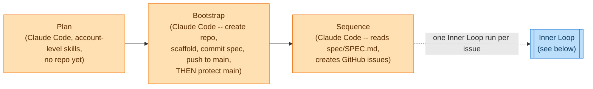
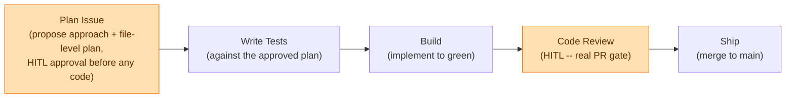

# Agent-Based Coding Workflow

## Principles

- **Plan before code, every time.** No stage writes production code without an approved plan to work from. This is the core guardrail: unsupervised work that goes down a wrong path costs more to unwind than doing it right the first time.
- **Mechanical steps run without a PR gate; judgment calls do.** Rendering a known template into a known repo is not a decision worth reviewing -- Bootstrap pushes straight to `main` because there's nothing to judge. Writing code against a plan is a decision worth reviewing -- the Inner Loop's Code Review step is a real PR gate. The gate is earned by risk, not applied uniformly.
- **One phone, one Claude Code session at a time.** Every stage in this workflow is reachable from Claude Code on the web, usable from a phone. No infrastructure of my own is provisioned or operated -- no orchestrator, no standing services. The one exception is the Inner Loop, which can also run unattended as a single Claude Managed Agent (`platform/agents/inner-loop.yml`) given a repo and an issue number; it still stops at a draft PR for human review. Anthropic runs the sessions; a human runs the workflow.
- **Tightly scoped sessions.** Each session does one thing: one repo bootstrap, one spec, one issue's plan, one issue's build. No session carries context across stages -- each reads what it needs from the repo (or, pre-repo, from the Plan doc) fresh.
- **Skills split by whether a repo exists yet.** `spec-authoring` and `adr-authoring` run during Plan, before any repo exists, so they are account-level skills on claude.ai -- there is nothing to commit into. Everything after Bootstrap (`issue-decomposition`, and the Inner Loop) can live in the repo's own `.claude/skills/`, seeded by the project template.
- **A found problem is just a problem.** There is no separate escalation path distinct from the normal flow. If Bootstrap's cookiecutter render doesn't match the repo slug, it stops and says so. If an issue's plan is too big, it gets split before Build starts. Nothing pushes through silently.

---

## The Workflow

Two loops. The **Outer Loop** runs once per project: Plan produces the spec and any ADRs before a repo exists; Bootstrap creates the repo, renders the template, and lands the spec on `main`; Sequence reads the approved spec and creates the GitHub issues. The **Inner Loop** runs once per issue Sequence created, repeating until the backlog is worked through.

**Inner Loop -- per issue.** Runs once per issue Sequence created. A Claude Code session plans the approach and waits for approval before writing any code; only then does it write tests, build against them, and open a PR. Human review and merge close it out.

_Legend -- 🟧 Claude Code, human-in-the-loop._

### Outer Loop

#### Outer · Plan `[Claude Code, HITL]`

**Goal:** Agree on what is being built, and record any decisions worth an ADR -- before any repository exists.

1. Voice-driven or typed conversation, from the phone, iterating until MVP scope is locked.
2. Guided by the account-level `spec-authoring` and `adr-authoring` skills. There is no checkout to write into yet, so the content is held in a Claude doc for the duration of Plan, not committed anywhere.
3. `spec-authoring` produces the spec content -- Status, Purpose, Inputs/Outputs, What we produce, Where we persist, Method, Done criteria (see "## Spec Artifact" below). `adr-authoring` produces any ADRs as their own sections in the same doc, numbered sequentially, only for decisions that are genuinely expensive to reverse later.
4. Human explicitly approves by stating the spec is approved in conversation -- a short reply or silence is not approval. `Status: approved` is what Bootstrap checks for before it will run.

**Exit condition:** An approved spec (and any ADRs) held in the Plan doc, ready for Bootstrap to commit. No repository exists yet.

---

#### Outer · Bootstrap `[Claude Code, HITL]`

**Goal:** Stand up the repo, render the project structure into it, and land the approved spec on `main` -- in one session, with `main` deliberately left open until the very last step so the mechanical work can land without a PR.

**Why one session, not split into Create Repo / Scaffold.** Both steps are mechanical -- creating a repo and rendering a known template into a known folder involve no judgment call worth a reviewable diff. Splitting them added credential and process overhead (a separate admin-scoped session, a PR gate on the render) that bought nothing, since there is nothing here to review. The credential-scoping concern that motivated the split is handled a different way: GitHub access goes through Claude Code's own GitHub proxy (the Claude GitHub App or `/web-setup`), never through a manually managed token, regardless of how many sessions this takes.

**Why `main` is protected last, not first.** Protecting `main` before this session's own push would block that push -- "require PR before merging" stops *any* direct push, including this session's. So branch protection is the last step, applied only once real content is already on `main`.

1. Read the approved spec from the Plan doc; derive the repo slug from it. `gh repo create <owner>/<slug>` -- `main` is left unprotected for now.
2. Seed the workflow's standard labels.
3. Read the `project-templates` repo to find the right Cookiecutter template (only directories with their own `cookiecutter.json`; skip leading-underscore directories). Read that template's `cookiecutter.json` before asking anything.
4. For every variable except `project_slug` (taken from the repo name, never asked): infer the answer from the approved spec rather than asking or defaulting silently. State each inferred answer before rendering ("spec doesn't mention logging -> defaulting structured logging off"). Only ask when the spec is genuinely silent and intent can't be inferred.
5. Clone the repo, render the template with `--output-dir` set to the repo's parent directory and `project_slug` set to the repo's own name, `--overwrite-if-exists` -- this renders directly into the existing checkout. Verify the rendered slug matches; stop on a mismatch.
6. Copy the approved spec into `spec/SPEC.md` and any ADRs into `spec/adrs/000N-*.md`.
7. Commit and push straight to `main`. This succeeds because `main` is still unprotected.
8. **Now** protect `main` -- require a PR before merging, require status checks, require at least one review. From this point on nothing lands on `main` without a reviewable diff.

**Exit condition:** Repo created, project structure rendered, `spec/SPEC.md` and any `spec/adrs/*.md` on `main`, and `main` now protected. Ready for Sequence.

---

#### Outer · Sequence `[Claude Code, HITL]`

**Goal:** Break the approved spec into individually-scoped GitHub issues, each sized to fit one Inner Loop run.

1. Guided by the `issue-decomposition` skill (now living in the repo's own `.claude/skills/`, seeded by the template -- Sequence runs after Bootstrap, so the repo exists).
2. Read `spec/SPEC.md`. Decompose it into issues fine enough that each one's acceptance criteria can be written without referencing another issue's internal design.
3. Create each as a real GitHub issue via `gh issue create`, using the installed issue template. This step only opens issues -- no code changes -- so it needs no PR either.

**Exit condition:** Real GitHub issues created from the approved spec. Each one is ready for its own Inner Loop run; there is no dependency graph or build order to maintain -- issues are worked through directly, one Inner Loop run at a time.

---

### Inner Loop -- per issue

Runs once per issue Sequence created.

#### Inner · Plan Issue `[Claude Code, HITL]`

**Goal:** Agree on the approach for this one issue before any code is written.

1. Read the issue, `spec/SPEC.md`, and any relevant ADRs.
2. Propose an approach and a file-level plan. Wait for approval before writing any code -- this is the guardrail against unsupervised work going down a wrong path.

**Exit condition:** An approved plan for this issue.

#### Inner · Write Tests `[Claude Code]`

**Goal:** Write the tests the approved plan will be built against, before implementation.

1. Author tests against the approved plan's acceptance criteria.

**Exit condition:** Tests written, run, and confirmed failing for the right reason (not an import/collection error).

#### Inner · Build `[Claude Code]`

**Goal:** Implement against the plan and the tests just written, until green.

1. Implement, committing as needed.
2. Run the full suite; iterate until it passes.

**Exit condition:** Full suite passing.

#### Inner · Code Review `[Claude Code, HITL]`

**Goal:** The real judgment gate. Everything upstream is either the human's own approved plan or a green test suite -- this is where a human actually reads the diff.

1. Open the PR (issue branch into `main`).
2. Human reviews the diff.
3. Approve, or request changes -- back to Build on the same branch if so.

**Exit condition:** Human approval.

#### Inner · Ship `[Claude Code]`

**Goal:** Land it.

1. Merge the approved PR into `main`.

**Exit condition:** Merged. Move to the next issue Sequence created.

---

## Spec Artifact (`spec/SPEC.md`)

One durable artifact the rest of the workflow reads against: a canonical `SPEC.md` under a dedicated `spec/` folder (`spec/SPEC.md`), alongside the project's ADRs (`spec/adrs/000N-*.md`).

**Authored before the repo exists.** Unlike a workflow where Spec Planning runs against an already-scaffolded checkout, here `SPEC.md` is drafted during Plan, held in a Claude doc, and only becomes a real file when Bootstrap commits it. There is no live checkout to write into during Plan -- that's the whole reason `spec-authoring` and `adr-authoring` are account-level skills rather than repo-committed ones.

### Structure

| Field | Contents |
|---|---|
| Status | `draft` while iterating in the Plan doc, `approved` once the human signs off -- this is what Bootstrap checks for |
| Purpose | One sentence: what problem this build solves |
| Inputs / Outputs | The contract -- what comes in, what comes out |
| What we produce | library \| CLI \| service \| batch |
| Where we persist | stateless \| file \| DB |
| Method | rules \| classical ML \| LLM |
| Done criteria | Observable, testable behaviors |

### Who reads it

- **Sequence** -- to decompose it into issues.
- **Inner Plan Issue** -- the product-level contract each issue's plan is scoped against.
- **Inner Build** -- alongside the issue's own approved plan.
- **Inner Code Review** -- what the diff is checked against.

### Who writes it

Claude Code, during Plan, guided by `spec-authoring`; the human iterates and approves. `project-bootstrap` commits the final, approved content to `spec/SPEC.md` as part of its own commit -- Plan itself never writes to a repo, since there isn't one yet. Once committed, the spec is treated as fixed; a further change re-enters Plan.
